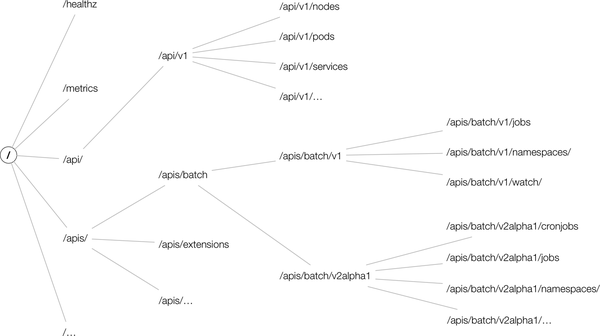

# Kubernetes API Versioning

1. _Alpha_ level (e.g., `v1alpha1`)
2. _Beta_ level (e.g., `v2beta3`)
3. Stable (generally available, or GA) level (e.g., v1)

<figure><figcaption></figcaption></figure>

* core group—that is, everything below _/api/v1_
* named groups in paths of the form _/apis/$`NAME`/$`VERSION`_

\
